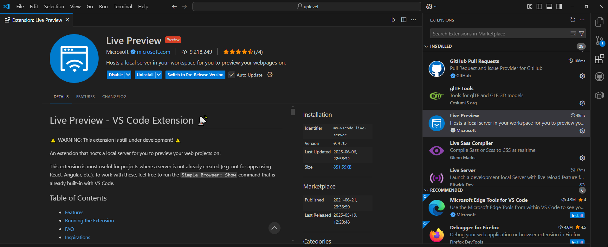
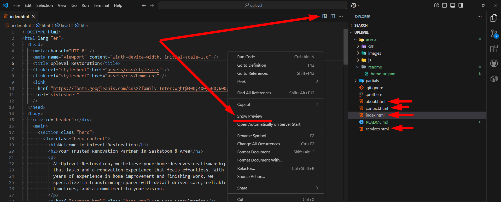
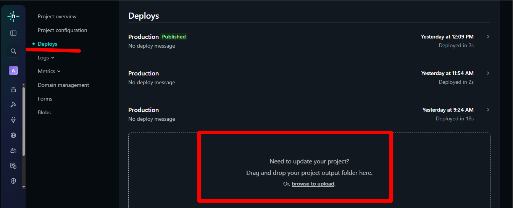
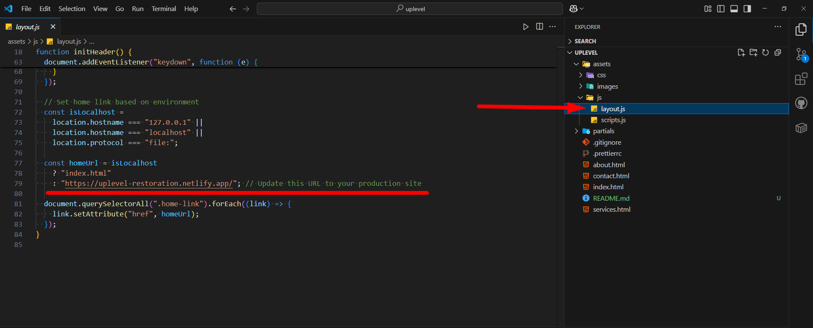

# Інструкція по редагуванню сайту Uplevel Restoration

Це керівництво допоможе вам легко вносити зміни до сайту компанії Uplevel Restoration без глибоких знань програмування.

## 🛠️ Підготовка до роботи

### Крок 1: Встановлення Visual Studio Code

1. Завантажте VS Code з офіційного сайту: https://code.visualstudio.com/
2. Встановіть програму на ваш комп'ютер

### Крок 2: Встановлення розширення Live Preview

**Live Preview** дозволить вам бачити зміни на сайті в реальному часі під час редагування.

1. Відкрийте VS Code
2. Натисніть на іконку розширень в лівій панелі (або Ctrl+Shift+X)
3. У пошуку введіть "Live Preview"
4. Знайдіть розширення від Microsoft і натисніть "Install"



### Крок 3: Відкриття проєкту

1. Завантажте папку з файлами сайту на ваш комп'ютер
2. У VS Code: File → Open Folder
3. Виберіть папку з файлами сайту

### Крок 4: Запуск Live Preview

1. Відкрийте файл `index.html`
2. Натисніть правою кнопкою миші у вікні редактора
3. Виберіть "Live Preview: Show Preview"
4. Сайт відкриється в новій вкладці VS Code



## 📁 Структура файлів проєкту

Ось як організовані файли вашого сайту:

```
uplevel-restoration-website/
├── index.html              # Головна сторінка
├── about.html              # Сторінка "Про нас"
├── services.html           # Послуги компанії
├── contact.html            # Контактна форма
├── README.md               # Ця інструкція
├── assets/
│   ├── css/               # Файли стилів (зовнішній вигляд)
│   │   ├── style.css      # Основні стилі
│   │   ├── home.css       # Стилі головної сторінки
│   │   ├── about.css      # Стилі сторінки "Про нас"
│   │   ├── services.css   # Стилі сторінки послуг
│   │   ├── contact.css    # Стилі сторінки контактів
│   │   └── modern-normalize.css # Базові стилі
│   ├── js/                # JavaScript файли (функціонал)
│   │   ├── layout.js      # Завантаження header/footer
│   │   └── scripts.js     # Основна логіка сайту
│   └── images/            # Всі зображення
│       ├── logo.png       # Логотип компанії
│       ├── favicon.svg    # Favicon для браузера
│       ├── home/          # Зображення для головної сторінки
│       ├── readme/        # Зображення для цієї інструкції
│       ├── about/         # Зображення для сторінки "Про нас"
│       └── services/      # Зображення для послуг
└── partials/              # Компоненти сайту
    ├── header.html        # Шапка сайту (меню)
    └── footer.html        # Підвал сайту
```

## 📝 Які файли редагувати для різних змін

### Зміна тексту на сторінках:

- **Головна сторінка**: `index.html`
- **Про нас**: `about.html`
- **Послуги**: `services.html`
- **Контакти**: `contact.html`

### Зміна меню сайту:

- Файл: `partials/header.html`

### Зміна підвалу (footer):

- Файл: `partials/footer.html`

### Заміна зображень:

- Покладіть нові зображення в відповідну папку в `assets/images/`
- Змініть посилання в HTML файлах

### Зміна стилів (кольори, шрифти, розміри):

- Відповідні CSS файли в папці `assets/css/`

## 🎨 Часті зміни

### Як змінити текст на сторінці:

1. Відкрийте потрібний HTML файл
2. Знайдіть текст, який потрібно змінити
3. Замініть його на новий
4. Збережіть файл (Ctrl+S)
5. Перевірте зміни в Live Preview

### Як замінити зображення:

#### Рекомендований формат зображень

**Використовуйте формат WebP** для кращої продуктивності сайту:

- WebP забезпечує кращу якість при меншому розмірі файлу
- Швидше завантаження сторінок
- Краща SEO оптимізація

**Де конвертувати зображення в WebP:**

- [Convertio](https://convertio.co/jpg-webp/) - онлайн конвертер
- [CloudConvert](https://cloudconvert.com/jpg-to-webp) - підтримує багато форматів
- [Squoosh](https://squoosh.app) - інструмент від Google
- [TinyPNG](https://tinypng.com) - також підтримує WebP конвертацію

#### Спосіб 1: Заміна через HTML файл

1. Скопіюйте нове зображення в відповідну папку `assets/images/`
2. Дайте йому зрозумілу назву (наприклад, `new-service-photo.webp`)
3. У HTML файлі знайдіть старе посилання на зображення
4. Замініть назву файлу на нову
5. Збережіть та перевірте результат

#### Спосіб 2: Пряма заміна файлу (рекомендований)

**Для сторінки Services (послуги):**

- Зображення названі відповідно до розділу послуг
- Наприклад: `assets/images/services/drywall.webp` відповідає блоку "Drywall" на сторінці services.html
- **Для заміни:** просто назвіть нове зображення точно так само (`drywall.webp`) і замініть старий файл
- Інші приклади назв: `plumbing.webp`, `electrical.webp`, `painting.webp` тощо

**Для сторінки About (про нас):**

- Зображення йдуть по порядку відображення на сторінці
- Назви: `assets/images/about/about-1.webp`, `assets/images/about/about-2.webp`, `assets/images/about/about-3.webp` тощо
- **Для заміни:** назвіть нове зображення з відповідним номером (`about-1.webp`, `about-2.webp`) і замініть потрібний файл

**Переваги способу 2:**

- Не потрібно редагувати HTML код
- Швидше та простіше
- Менше шансів на помилки
- Зміни відразу відображаються на сайті

### Як змінити кольори:

1. Відкрийте відповідний CSS файл
2. Знайдіть код кольору (наприклад, `#ff0000` або `blue`)
3. Замініть на новий колір
4. Збережіть та перевірте зміни

## 🚀 Публікація змін на Netlify

### Спосіб - Drag & Drop

1. Зайдіть на сайт Netlify: https://www.netlify.com/
2. Увійдіть в свій акаунт
3. Знайдіть ваш сайт в списку та виберіть в боковому меню `Deploys`
4. Перетягніть всю папку з файлами в область "Drag and drop"
5. Зачекайте завершення завантаження
6. Скопіюйте посилання на новий сайт
7. Замініть старий сайт новим в [файлі](assets/js/layout.js)
8. Так само замініть назву після прив'язки свого домену




## ⚠️ Важливі поради

### Завжди робіть резервну копію:

- Перед внесенням змін скопіюйте всю папку проєкту
- Називайте копії з датою (наприклад, `backup-2024-06-09`)

### Тестуйте локально:

- Завжди перевіряйте зміни в Live Preview
- Переконайтеся, що всі сторінки працюють

### Назви файлів:

- Використовуйте англійські літери
- Без пробілів (використовуйте `-` або `_`)
- Зберігайте оригінальні розширення (.html, .css, .js, .jpg)

## 🔧 Корисні поради для редагування

### Пошук тексту:

- Використовуйте Ctrl+F для пошуку конкретного тексту в файлі
- Ctrl+H для заміни тексту

### Форматування коду:

- Shift+Alt+F для автоматичного форматування HTML

### Попередній перегляд:

- Завжди тримайте відкритим Live Preview
- Зміни відображаються автоматично після збереження

## 📞 Що робити, якщо щось пішло не так

1. **Відновіть з резервної копії** - скопіюйте файли з останньої робочої версії
2. **Перевірте консоль браузера** - натисніть F12 та подивіться на помилки
3. **Порівняйте з робочою версією** - що змінилося з останнього разу

## 📈 Рекомендації по оптимізації

- **Зображення**: стискайте великі фото перед додаванням
- **Текст**: пишіть зрозуміло та структуровано
- **Тестування**: перевіряйте сайт на різних пристроях

---

_Ця інструкція створена для легкого редагування сайту Uplevel Restoration. Якщо виникають питання - зверніться до розробника._
